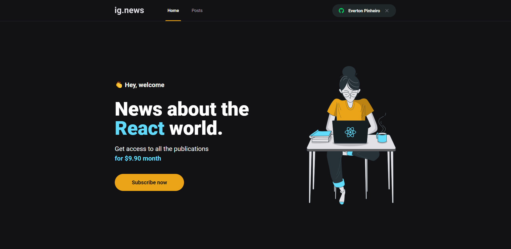

<h1 align="center">
  
</h1>

<h3 align="center">
  Ignite - Chapter III: ignews
  <br>
  Aplicação desenvolvida durante o chapter III do bootcamp Ignite - trilha React da Rocketseat. Ig.news é uma aplicação que fornece conteúdo pago sobre React.js. O usuário faz seu cadastro, paga um valor por mês e tem acesso aos posts da aplicação
  <br>
  Ignews foi desenvolvido em React.js com Next.js, TypeScript e Sass, a autenticação da aplicação é feita através do GitHub e a inscrição e pagamento para visualização do conteúdo através do Stripe. Os posts são gerenciados através da CMS Prismic e os dados de inscrição são armazenados no Faunadb
</h3>

<!-- <p align="center">See in action: <a href="https://www.notion.so/Desafio-02-Componentizando-a-aplica-o-b9f0f025c95b437699d0c3115f55b0f1">click here</a></p> -->

<p align="center">
  

  

  <a href="https://github.com/lcoalves">
    
  </a>

  <a href="https://github.com/lcoalves/ignews/stargazers">
    
  </a>
</p>

## Getting Started

These instructions will get you a copy of the project up and running on your local machine for development and testing purposes. See deployment for notes on how to deploy the project on a live system.

### Prerequisites
- [NodeJS](https://nodejs.org/en/) - Environment runtime
- [Yarn](https://yarnpkg.com/getting-started/install) - Packager manager

What things you need to install the software and how to install them
https
```
git clone https://github.com/lcoalves/ignews.git
```
ssh
```
git clone git@github.com:lcoalves/ignews.git
```

### Installing

A step by step series of examples that tell you how to get a development env running

#### Databases
First install dependencies
```
$> cd ignews && yarn
```
Next open the code
```
$> code .
```

#### Front-end
Start front-end
```
$> yarn dev
```

## Built With

* [React](https://reactjs.org/docs/getting-started.html) - A JavaScript library for building user interfaces
* [NextJS](https://nextjs.org/docs) - The React Framework
for Production
* [Stripe](https://stripe.com/docs) - Payments infrastructure for the internet
* [Prismic CMS](https://prismic.io/docs) - Make your website editable for the whole team

## Authors

* **Lucas Alves** - *IT Development Specialist* - [GitHub profile](https://github.com/lcoalves)

## License

This project is licensed under the MIT License - see the [LICENSE.md](https://github.com/lcoalves/ignews/blob/master/LICENSE) file for details

## Acknowledgments

* JAMStack
* React
* NextJS
* NextJS Auth
* Stripe
* Prismic CMS
